# Repository Architecture (Phase 0)

This document maps the code that is actually active for the SAE stability research workflow, plus current execution status after initial reliability fixes.

## 1) High-Level Structure

Core implementation:
- `src/data/` - modular arithmetic dataset generation and dataloaders
- `src/models/` - transformer wrapper and SAE wrappers/models
- `src/training/` - shared SAE training loop
- `src/analysis/` - feature matching, Fourier and analysis utilities

Orchestration scripts:
- `scripts/training/` - baseline transformer and SAE training entry points
- `scripts/analysis/` - extraction and stability analysis scripts
- `scripts/experiments/` - experiment-level workflows and sweeps

Configuration and infra:
- `configs/` - YAML experiment configs
- `requirements*.txt`, `environment.yml`, `pyproject.toml` - environment definitions
- `Makefile` - task shortcuts

Outputs:
- `results/` - trained checkpoints, metrics, JSON outputs
- `figures/` - generated figures
- `paper/` - manuscript draft

Historical/non-core:
- `archive/` - old scripts/notes; useful context, not production path

## 2) Main Data/Training Flow

```mermaid
flowchart LR
  A[ModularArithmeticDataset\nsrc/data/modular_arithmetic.py]
  B[Train Transformer\nscripts/training/train_baseline.py]
  C[Transformer Checkpoint\nresults/.../transformer_*.pt]
  D[Extract Activations\nscripts/analysis/extract_activations.py]
  E[Activation Tensor\nresults/activations/*.pt]
  F[Train SAE\nscripts/training/train_sae.py\nsrc/training/train_sae.py]
  G[SAE Checkpoints\nresults/saes/*]
  H[Stability Analysis\nscripts/analysis/analyze_feature_stability.py]
  I[Artifacts\nresults/analysis + figures + paper]

  A --> B --> C --> D --> E --> F --> G --> H --> I
```

## 3) Text Dependency Graph (Critical Modules)

- `scripts/training/train_baseline.py`
  - imports `src/models/transformer.py`
  - imports `src/data/modular_arithmetic.py`
  - imports `src/utils/config.py`
- `scripts/analysis/extract_activations.py`
  - imports `src/models/transformer.py`
  - imports `src/data/modular_arithmetic.py`
  - imports `src/utils/config.py`
- `scripts/training/train_sae.py`
  - imports `src/models/sae.py`
  - imports `src/training/train_sae.py`
  - imports `src/utils/config.py`
  - imports `scripts.analysis.extract_activations`
- `scripts/analysis/analyze_feature_stability.py`
  - imports `src/models/simple_sae.py`
  - imports `src/analysis/feature_matching.py`

## 4) Current Execution Reality (Validated)

Working:
- Direct and module entrypoints now both run for baseline, extraction, and SAE training smoke tests.
- `run_training.sh` runs successfully with corrected module path.
- End-to-end pipeline script runs: `python tests/test_sae_pipeline.py --transformer-checkpoint ...`.
- Full test suite passes: `83 passed` via `pytest tests -q`.

Known caveats:
- This machine still needs `KMP_DUPLICATE_LIB_OK=TRUE` due OpenMP runtime collision.
- Some imports require `TMPDIR=/tmp` here due local temp-space constraints.
- One-epoch SAE smoke quality is low (expected for short runs); this is a quality issue, not execution failure.

## 5) Remaining Portability Risks

- Hardcoded absolute base paths still exist in auxiliary scripts outside the main experiment/analysis path.
  - Example: `scripts/training/train_expanded_seeds.py:48`
- Some long-form docs still contain stale paths or one-off local instructions.
- Environment spec remains split across multiple files without a lockfile.
