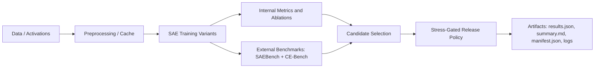

# Architecture and Critical Path

Updated: 2026-03-05

## Repo Goal and Claims

### Explicit goal

Evaluate whether SAE features can be trusted under a strict release standard combining:
- internal consistency
- stress robustness
- external benchmark competitiveness

### Implicit claim discipline

No release claim is accepted unless all gates pass in one policy decision. Current decision remains `pass_all=false`.

## How It Works (Data -> Artifacts)


```mermaid
flowchart LR
  A[Data / Activations] --> B[Preprocessing / Cache]
  B --> C[SAE Training Variants]
  C --> D[Internal Metrics and Ablations]
  C --> E[External Benchmarks: SAEBench + CE-Bench]
  D --> F[Candidate Selection]
  E --> F
  F --> G[Stress-Gated Release Policy]
  G --> H[Artifacts: results.json, summary.md, manifest.json, logs]
```

## Minimal Reproducible Demo

```bash
pytest tests -q
python scripts/experiments/run_phase4a_reproduction.py
python scripts/experiments/run_core_ablations.py
```

## Critical Path Files (Top 10)

1. `scripts/experiments/run_phase4a_reproduction.py` - trained vs random control baseline.
2. `scripts/experiments/run_core_ablations.py` - core `k` and `d_sae` sweeps.
3. `scripts/experiments/run_assignment_consistency_v3.py` - assignment-aware objective branch.
4. `scripts/experiments/run_architecture_frontier_external.py` - external architecture frontier.
5. `scripts/experiments/run_routed_frontier_external.py` - routed SAE frontier variant.
6. `scripts/experiments/run_husai_saebench_custom_eval.py` - SAEBench adapter.
7. `scripts/experiments/run_husai_cebench_custom_eval.py` - CE-Bench adapter.
8. `scripts/experiments/select_release_candidate.py` - uncertainty-aware selection.
9. `scripts/experiments/run_stress_gated_release_policy.py` - strict gate decision.
10. `src/training/train_sae.py` - shared SAE training loop.

## Hidden Assumptions / Operational Risks

1. Remote package paths are not fully mirrored in this checkout (`EVIDENCE_STATUS.md`).
2. Benchmark reproducibility depends on external repos/environments for SAEBench and CE-Bench.
3. GPU availability and runtime env variables influence stability/performance.

## Evidence Pointers

- Local verified snapshots: `docs/evidence/`
- Evidence-tier policy: `EVIDENCE_STATUS.md`
- Experiment trace log: `EXPERIMENT_LOG.md`
