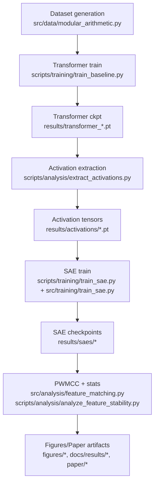

# Phase 1 Repo Understanding

This file captures the Phase 1 outputs requested: repo goal and claims, minimal reproducible demo, system diagram, and critical code path pointers.

## 1) Goal and Claims

### Observed research goal
The repo aims to study stability/reproducibility of Sparse Autoencoder (SAE) features across seeds, mainly on algorithmic transformer tasks (modular arithmetic and copy-like tasks), and to test whether reconstruction quality implies representational consistency.

Primary evidence:
- `README.md` (project framing, "Verified Findings")
- `paper/sae_stability_paper.md` (problem statement and claimed contributions)
- `scripts/analysis/analyze_feature_stability.py` + `src/analysis/feature_matching.py` (PWMCC-based evaluation)

### Explicit claims in repo docs
- Dense-ground-truth regimes produce low SAE stability near random baseline.
- Stability varies with sparsity/parameterization and can trade off with reconstruction.
- Findings are argued to be task-general (modular arithmetic and copy task).

Evidence artifacts:
- `results/analysis/trained_vs_random_pwmcc.json`
- `docs/results/phase1_topk_stability.md`
- `docs/results/phase2_architecture_comparison.md`
- `docs/VERIFIED_FINDINGS_FOR_PAPER.md`

### Implicit claims in codebase behavior
- Decoder-space similarity (PWMCC) is the core stability metric (`src/analysis/feature_matching.py:45`).
- The primary training target activations are layer-1 residual stream at answer token position (`scripts/analysis/extract_activations.py:136-139`).
- Sequence format expects `[BOS, a, +, b, =, c, EOS]` and predicts answer at `-2` (`scripts/training/train_baseline.py:73-77`).

## 2) Minimal Reproducible Demo (Current-State, Validated)

### What currently works end-to-end
1. Train baseline transformer for 1 epoch:
```bash
KMP_DUPLICATE_LIB_OK=TRUE python -m scripts.training.train_baseline \
  --config configs/examples/baseline_relu.yaml \
  --epochs 1 \
  --batch-size 128 \
  --no-wandb \
  --save-dir /tmp/husai_demo
```

2. Extract layer activations from that checkpoint:
```bash
KMP_DUPLICATE_LIB_OK=TRUE python -m scripts.analysis.extract_activations \
  --model-path /tmp/husai_demo/transformer_final.pt \
  --layer 1 \
  --position answer \
  --batch-size 128 \
  --output /tmp/husai_demo/acts.pt
```

3. Run stable unit tests for data/config foundation:
```bash
KMP_DUPLICATE_LIB_OK=TRUE pytest tests/unit/test_modular_arithmetic.py -q
KMP_DUPLICATE_LIB_OK=TRUE pytest tests/unit/test_config.py -q
```

Observed now:
- `test_modular_arithmetic.py`: 43 passed
- `test_config.py`: 33 passed

### Remaining limitations after initial fixes
- Commands now execute from both module and direct script paths for baseline, extraction, and SAE training smoke tests.
- One-epoch SAE smoke runs show poor explained variance (quality issue, not execution blocker).
- This file is a historical phase snapshot (2026-02-12); external benchmark integration status is now tracked in `HIGH_IMPACT_FOLLOWUPS_REPORT.md`, `EXECUTIVE_SUMMARY.md`, and `LIT_REVIEW.md`.

## 3) How It Works Diagram (Data -> Artifacts)



## 4) Critical Path Pointer

See `CRITICAL_PATH.md` for the 10 files that currently define the core research pipeline and failure surface.
